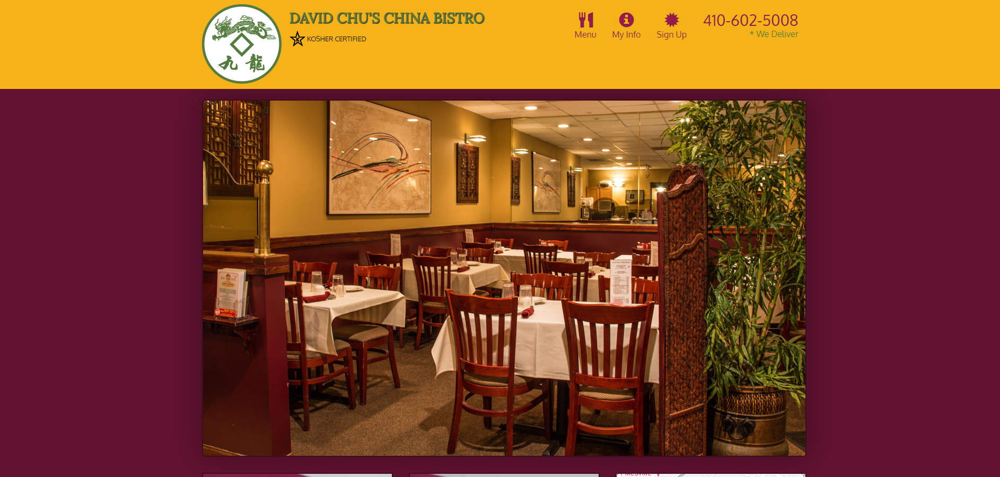
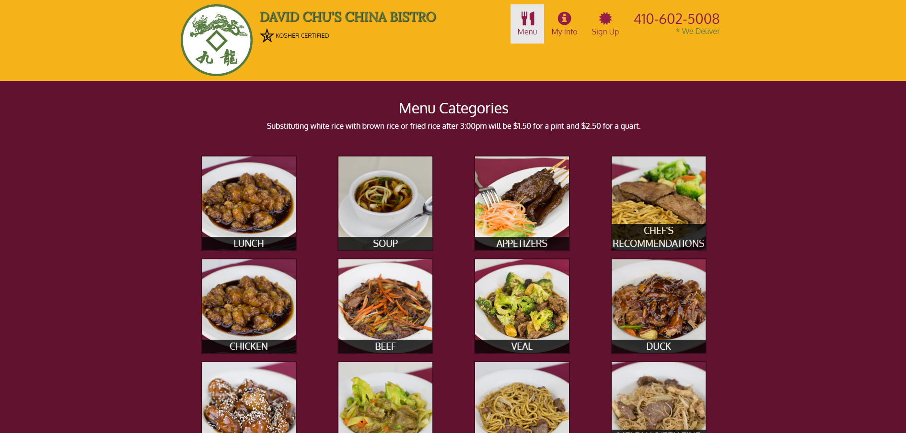
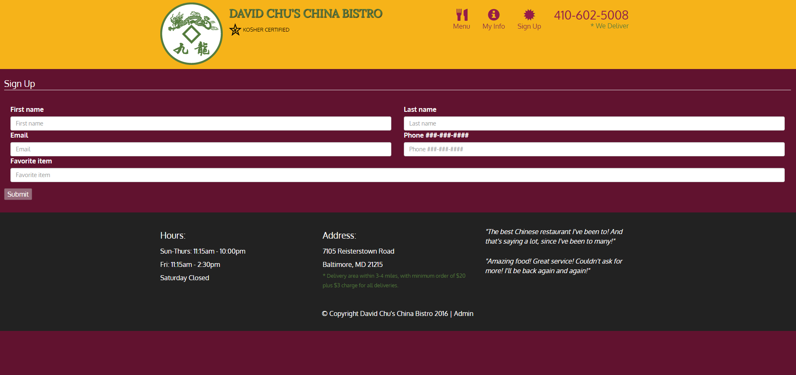

# Coursera - John Hopkings - AngularJS Course

This repository contains a series of projects developed during the course as assigments
some AngularJS concepts applied are:
 - Modules
 - Controllers
 - Dependendecy Injection
 - Services
 - Directives
 - Components
 - Routes
 - Templates

The assigments can be accessed using Github pages:
 - https://rafaelbp92.github.io/coursera-spa-angularjs/assignment1
 - https://rafaelbp92.github.io/coursera-spa-angularjs/assignment2
 - https://rafaelbp92.github.io/coursera-spa-angularjs/assignment3
 - https://rafaelbp92.github.io/coursera-spa-angularjs/assignment4
 - https://rafaelbp92.github.io/coursera-spa-angularjs/assignment5

In the last assigment a more complete web application was developed to simulate a Restaurtant Web application

